# 🔄 CI/CD Pipeline - Diagrammes Visuels

Ce document contient des diagrammes visuels du pipeline CI/CD de ClubManager.

---

## 📊 Pipeline Complet

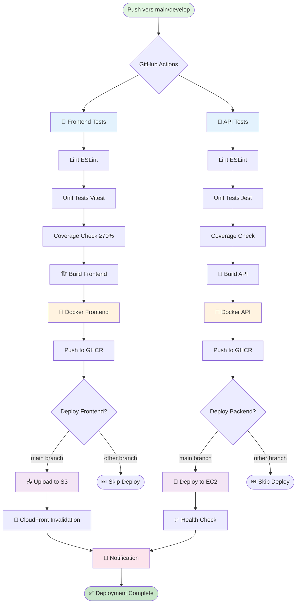

---

## 🏗️ Architecture de Déploiement

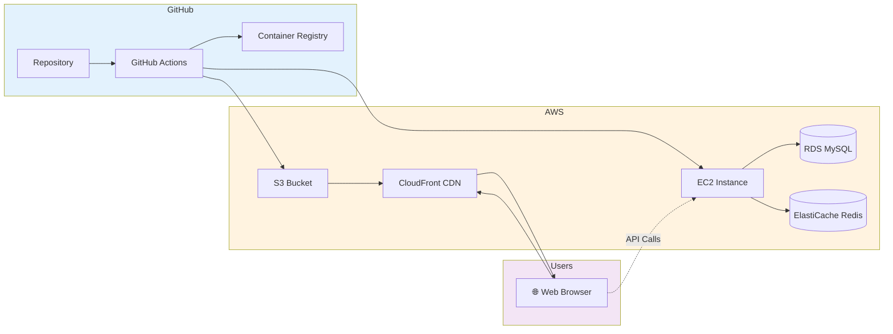

---

## 🔄 Workflow Détaillé Frontend

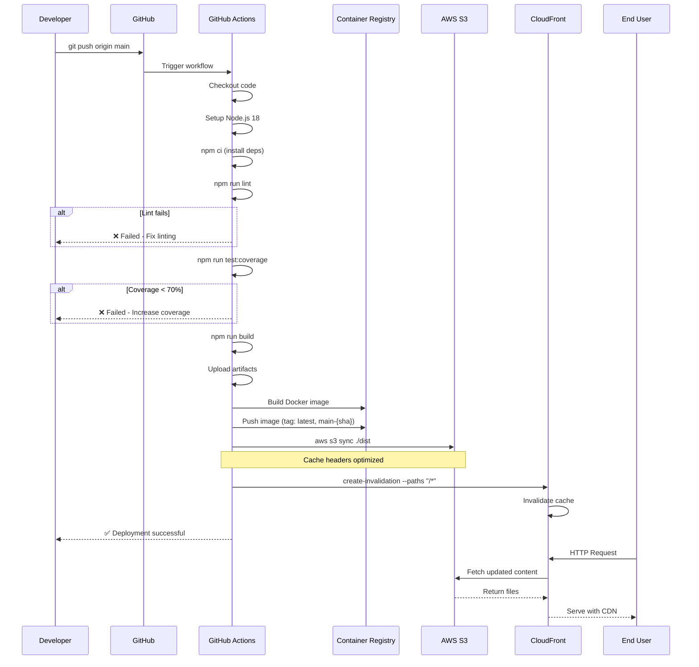

---

## 🔧 Workflow Détaillé Backend

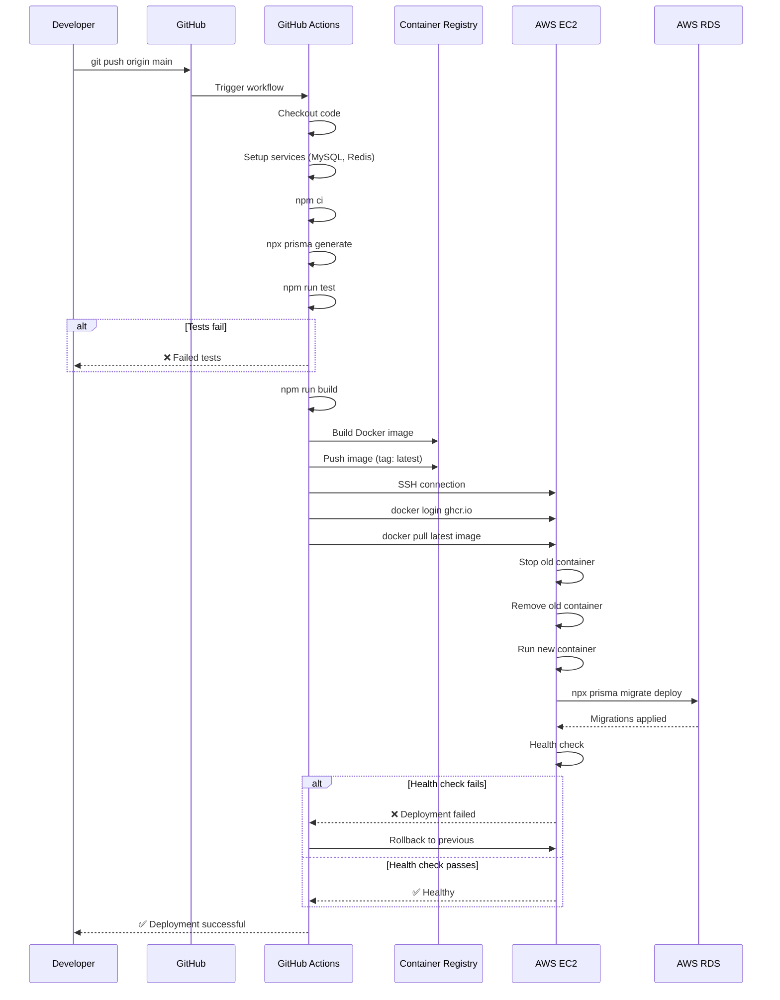

---

## 🌍 Flux de Trafic Utilisateur

```mermaid
graph TB
    User[👤 User Browser]
    
    subgraph DNS
        R53[Route 53]
    end
    
    subgraph Frontend
        CF[CloudFront CDN]
        S3[S3 Static Files]
    end
    
    subgraph Backend
        ALB[Application Load Balancer]
        EC2_1[EC2 Instance 1]
        EC2_2[EC2 Instance 2]
    end
    
    subgraph Data
        RDS[(RDS MySQL)]
        Redis[(ElastiCache Redis)]
    end
    
    User -->|1. DNS Query| R53
    R53 -->|2. CloudFront IP| User
    User -->|3. HTTPS Request| CF
    CF -->|Cache Hit| User
    CF -->|Cache Miss| S3
    S3 -->|Static Files| CF
    
    User -.4. API Calls.-> ALB
    ALB --> EC2_1
    ALB --> EC2_2
    EC2_1 --> RDS
    EC2_2 --> RDS
    EC2_1 --> Redis
    EC2_2 --> Redis
    
    style User fill:#e1f5e1
    style CF fill:#e3f2fd
    style RDS fill:#fff3e0
```

---

## 🔄 Processus de Rollback

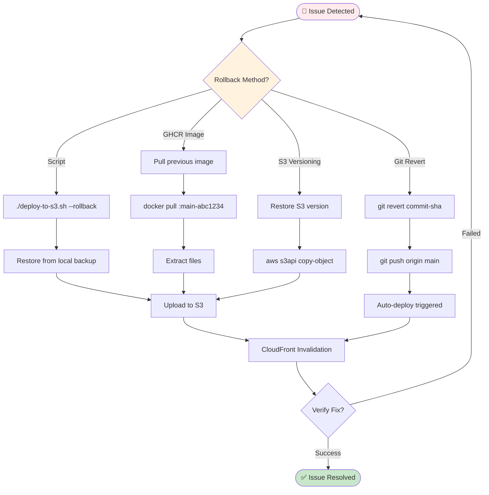

---

## 🔐 Secrets Management

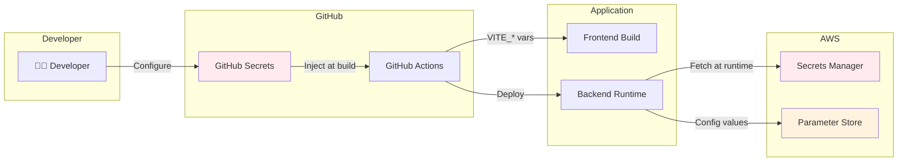

---

## 📊 Environnements de Déploiement

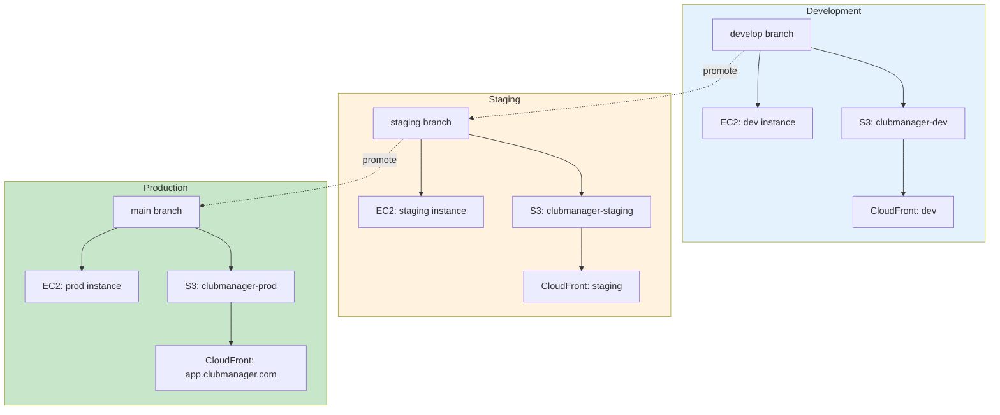

---

## 🚀 Scaling Strategy

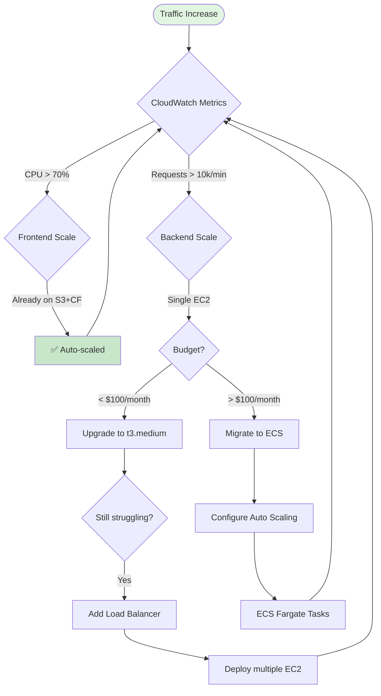

---

## 📈 Monitoring & Alerting

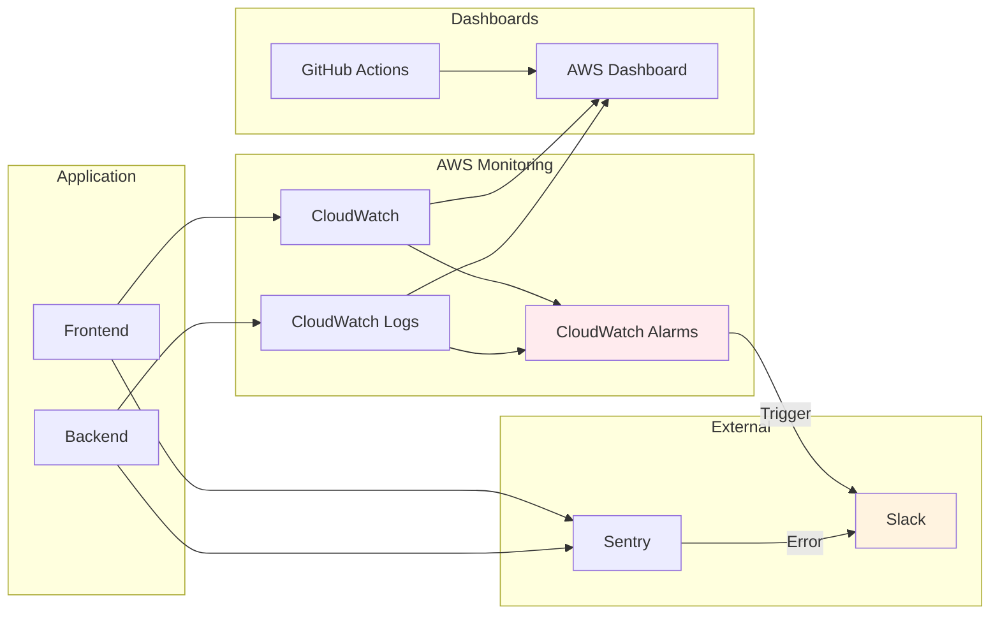

---

## 💰 Cost Breakdown

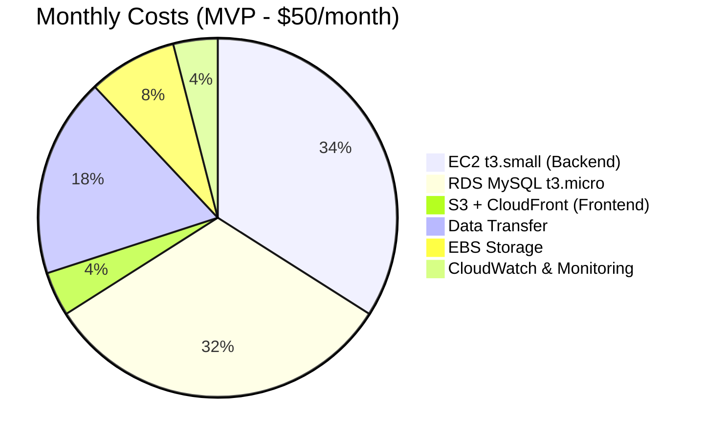

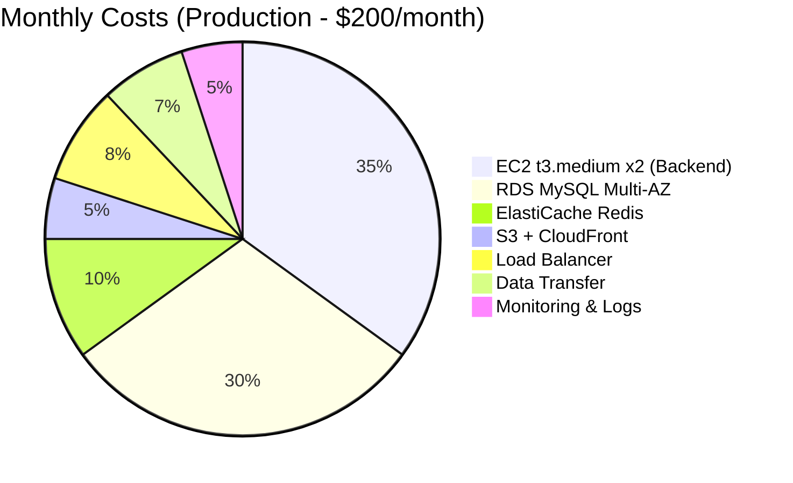

---

## 🔄 CI/CD Timeline

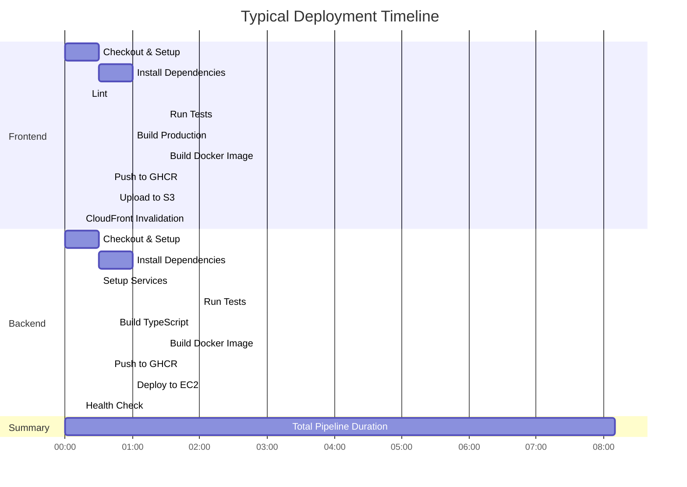

---

## 📝 Notes

Ces diagrammes sont générés avec **Mermaid** et peuvent être visualisés directement dans GitHub.

Pour afficher ces diagrammes :
- Sur GitHub : ils s'affichent automatiquement
- Localement : utilisez l'extension VSCode "Markdown Preview Mermaid Support"
- En ligne : https://mermaid.live/

---

**Légende des couleurs :**
- 🟢 Vert : Succès / Complétion
- 🔵 Bleu : Tests / Validation
- 🟡 Jaune : Build / Processing
- 🟣 Violet : Déploiement
- 🔴 Rouge : Alertes / Rollback