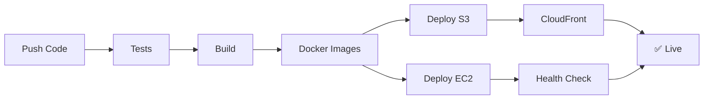

# 📚 Documentation - ClubManager AWS Deployment

Bienvenue dans la documentation complète du déploiement de ClubManager sur AWS avec GitHub Actions et GHCR.

---

## 🚀 Démarrage Rapide

> **Nouveau ici ?** Commencez par le [Quick Start Guide](./QUICKSTART_AWS_DEPLOYMENT.md) pour déployer en 5 minutes !

---

## 📖 Documentation Disponible

### 🎯 Guides Essentiels

| Guide | Description | Pour qui ? | Temps |
|-------|-------------|------------|-------|
| **[📋 INDEX](./INDEX.md)** | **Navigation complète** | Tous | 5 min |
| **[🚀 Quick Start](./QUICKSTART_AWS_DEPLOYMENT.md)** | Déployer rapidement | Débutant | 15 min |
| **[📖 AWS Setup](./AWS_DEPLOYMENT_SETUP.md)** | Configuration détaillée | Intermédiaire | 1-2h |
| **[✅ Checklist](./DEPLOYMENT_CHECKLIST.md)** | Liste complète | Tous | Variable |
| **[🔄 CI/CD Overview](./CI_CD_OVERVIEW.md)** | Architecture pipeline | Avancé | 30 min |
| **[📊 Comparaison](./DEPLOYMENT_COMPARISON.md)** | Options de déploiement | Décideur | 20 min |
| **[📈 Diagrams](./CI_CD_PIPELINE_DIAGRAM.md)** | Visualisation | Visuel | 10 min |

---

## 🎯 Je cherche à...

### 🏃 Déployer rapidement
```
1. Quick Start Guide (15 min)
2. Suivre les commandes
3. C'est déployé ! ✅
```
→ [Quick Start Guide](./QUICKSTART_AWS_DEPLOYMENT.md)

### 🧠 Comprendre l'architecture
```
1. CI/CD Overview (30 min)
2. Pipeline Diagrams (10 min)
3. Architecture maîtrisée ✅
```
→ [CI/CD Overview](./CI_CD_OVERVIEW.md)

### 🔍 Choisir la bonne solution
```
1. Deployment Comparison (20 min)
2. Matrice de décision
3. Choix éclairé ✅
```
→ [Deployment Comparison](./DEPLOYMENT_COMPARISON.md)

### 📝 Setup complet pas à pas
```
1. Deployment Checklist (2-3h)
2. Cocher les cases
3. Infrastructure prête ✅
```
→ [Deployment Checklist](./DEPLOYMENT_CHECKLIST.md)

---

## 🗺️ Architecture

```
┌─────────────────────────────────────────────────────┐
│              GitHub Repository                       │
│   Frontend (React) + Backend (Node.js)             │
└─────────────────┬───────────────────────────────────┘
                  │
                  │ Push triggers CI/CD
                  ▼
┌─────────────────────────────────────────────────────┐
│              GitHub Actions                          │
│   Tests → Build → Docker → Deploy                   │
└─────────────┬───────────────┬───────────────────────┘
              │               │
              ▼               ▼
    ┌─────────────────┐  ┌──────────────┐
    │  GHCR (backup)  │  │  AWS Cloud   │
    │  Docker Images  │  │  S3 + EC2    │
    └─────────────────┘  └──────┬───────┘
                                │
                                ▼
                          🌐 End Users
```

---

## 💰 Coûts Estimés

| Configuration | Coût/mois | Pour qui ? |
|--------------|-----------|------------|
| **MVP** | $35-50 | Démarrage |
| **Production** | $150-200 | Croissance |
| **Enterprise** | $500+ | Scale |

Détails : [Deployment Comparison](./DEPLOYMENT_COMPARISON.md#-estimation-des-coûts)

---

## 🛠️ Technologies

### Frontend
- **Hébergement:** AWS S3 + CloudFront CDN
- **CI/CD:** GitHub Actions
- **Registry:** GitHub Container Registry (GHCR)
- **Build:** Vite + React

### Backend
- **Hébergement:** AWS EC2 + Docker
- **Database:** AWS RDS MySQL
- **Cache:** Redis (local ou ElastiCache)
- **CI/CD:** GitHub Actions

---

## 📋 Checklist Rapide

### Configuration AWS
- [ ] Bucket S3 créé
- [ ] CloudFront distribution active
- [ ] Utilisateur IAM configuré
- [ ] EC2 instance lancée
- [ ] RDS MySQL créé

### Configuration GitHub
- [ ] Secrets configurés (AWS keys, etc.)
- [ ] Workflow vérifié
- [ ] Branch protection activée
- [ ] Environments configurés

### Premier Déploiement
- [ ] Tests locaux passés
- [ ] Build frontend réussi
- [ ] Déploiement S3 testé
- [ ] API accessible
- [ ] Monitoring en place

➡️ Checklist complète : [Deployment Checklist](./DEPLOYMENT_CHECKLIST.md)

---

## 🔄 Workflow CI/CD



Détails : [Pipeline Diagrams](./CI_CD_PIPELINE_DIAGRAM.md)

---

## 🆘 Problèmes Fréquents

| Problème | Solution Rapide |
|----------|----------------|
| Site pas mis à jour | Invalider cache CloudFront |
| 403 sur S3 | Vérifier bucket policy |
| 404 sur refresh | Configurer CloudFront error pages |
| GitHub Actions fail | Vérifier secrets GitHub |
| API down | Vérifier logs EC2/CloudWatch |

➡️ Guide complet : [AWS Setup - Troubleshooting](./AWS_DEPLOYMENT_SETUP.md#troubleshooting)

---

## 📚 Parcours d'Apprentissage

### 🎓 Débutant (2-3h)
```
1. Quick Start Guide
2. Pipeline Diagrams
3. Deployment Checklist (base)
4. Premier déploiement
```

### 💼 Intermédiaire (4-5h)
```
1. AWS Setup Complet
2. CI/CD Overview
3. Deployment Comparison
4. Deployment Checklist (complet)
```

### 🚀 Avancé (6-8h)
```
1. Tous les documents
2. Personnalisation workflows
3. Multi-environnements
4. Optimisation & HA
```

---

## 🔗 Liens Utiles

### Documentation AWS
- [S3 Static Hosting](https://docs.aws.amazon.com/AmazonS3/latest/userguide/WebsiteHosting.html)
- [CloudFront](https://docs.aws.amazon.com/cloudfront/)
- [EC2 User Guide](https://docs.aws.amazon.com/ec2/)
- [Pricing Calculator](https://calculator.aws/)

### GitHub
- [GitHub Actions](https://docs.github.com/actions)
- [Container Registry](https://docs.github.com/packages)
- [Encrypted Secrets](https://docs.github.com/actions/security-guides/encrypted-secrets)

---

## 📞 Support

### Obtenir de l'Aide
1. 📖 Consultez l'[INDEX](./INDEX.md) pour trouver rapidement
2. 🐛 [GitHub Issues](https://github.com/your-org/ClubManager/issues)
3. 💬 [GitHub Discussions](https://github.com/your-org/ClubManager/discussions)
4. 📧 support@clubmanager.com

### Contribuer
1. Fork le repository
2. Améliorer la documentation
3. Créer une Pull Request

---

## 🎯 Prochaines Étapes

1. **Choisissez votre guide** selon votre besoin ci-dessus
2. **Consultez l'[INDEX](./INDEX.md)** pour une navigation complète
3. **Suivez la checklist** pour ne rien oublier
4. **Déployez !** 🚀

---

## 📊 Vue d'Ensemble des Documents

```
docs/
├── README.md ⭐                       # Ce fichier
├── INDEX.md 📋                        # Navigation complète
│
├── QUICKSTART_AWS_DEPLOYMENT.md 🚀    # Démarrer en 5 min
├── AWS_DEPLOYMENT_SETUP.md 📖         # Guide AWS complet
├── DEPLOYMENT_CHECKLIST.md ✅         # Checklist détaillée
│
├── CI_CD_OVERVIEW.md 🔄               # Architecture pipeline
├── DEPLOYMENT_COMPARISON.md 📊        # Comparaison options
└── CI_CD_PIPELINE_DIAGRAM.md 📈       # Diagrammes visuels
```

---

## 💡 Conseils

> **Nouveau sur AWS ?** Commencez par [Quick Start](./QUICKSTART_AWS_DEPLOYMENT.md)

> **Besoin de comparer ?** Voir [Deployment Comparison](./DEPLOYMENT_COMPARISON.md)

> **Setup complet ?** Suivez la [Checklist](./DEPLOYMENT_CHECKLIST.md)

> **Perdu ?** Consultez l'[INDEX](./INDEX.md)

---

**Happy Deploying! 🚀**

*ClubManager Team - 2024*